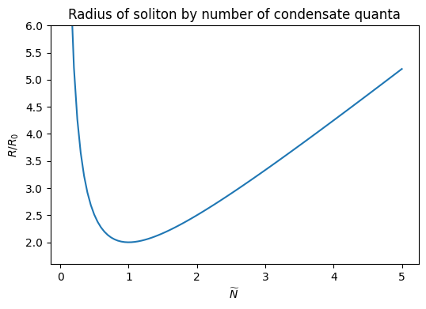

# Nonlinear Schrödinger soliton - stationary, 1 dimension
This is probably the simplest soliton you can possibly have.
The potential is a combination of a low-density attractive term, and a high-density repulsive term
$$ V(\psi) = \alpha (|\psi|^2 - \bar{\psi}^2)^2 = -\alpha \bar{\psi}^2 |\psi|^2 + \alpha |\psi|^4 $$
which results in a stable solution with a core density of $|\psi| \sim \bar{\psi}$.
The time-independent equation of motion is
$$
-\frac{1}{2m} \frac{d^2\psi}{dx^2} + \alpha(|\psi|^2 - \bar{\psi}^2)^2\psi = E \psi
$$
## Approximate analytic solution
We can use the variational method with a Gaussian ansatz $\psi(x) = \psi_0 e^{-(x/R)^2}$ in order to derive an approximate solution.
Assuming the wave function is normalized to $\langle\psi|\psi\rangle = N$ (where $N$ is the number of quanta in the condensate), we can rewrite $\psi_0$ as
$$ \psi_0 = \left(\sqrt{\frac{2}{\pi}}\frac{N}{R}\right)^{1/2} $$
Evaluating the variational energy $\widetilde{E} = \langle \psi | \hat{H} | \psi \rangle$ (and substituting the above value of $\psi_0$), we can minimize with respect to $R$:
$$
\frac{d\widetilde{E}}{dR} = 0 \implies R = \frac{4\sqrt{3} N^2 \alpha m + 3\pi}{6\sqrt{\pi} N \alpha \bar{\psi}^2 m}
= R_0 \frac{\widetilde{N}^2 + 1}{\widetilde{N}} \\ \, \\ \text{where }
R_0 = (3^{1/4} \bar{\psi}^2 \sqrt{\alpha m})^{-1}, \quad
N = \sqrt{\frac{3\pi}{4\sqrt{3}\alpha m}} \widetilde{N}.
$$
We can see that for $\widetilde{N} \ll 1$ the radius actually decreases with increasing quanta like $O(1/N)$, but for $\widetilde{N} \gg 1$ the radius increses linearly.
It is likely that in the low-number regime, the soliton hasn't reached sufficient mass to bind effectively.

## Numerical solution
The time-independent Schrodinger equation above is generally solved numerically using a shooting method to find the appropriate energy eigenvalue $E$ given the other free parameters $m$, $\alpha$, $\bar{\psi}$ and satisfactory boundary conditions (in this case, $\psi(\pm\infty) = 0$).
However, we can take an alternative route by building off our approximate analytic solution and using a relaxation technique...

<!--
We can reduce the number of free parameters by non-dimensionalizing this equation, resulting in
$$
\frac{d^2\xi}{dy^2} - \beta \left[ \left(|\xi|^2 - 1\right)^2 + \mathcal{E} \right] \xi = 0
$$
where $y = x/x_0$, $\beta = 2mx_0^2\alpha\bar{\psi}^2$, and $\mathcal{E} = E/\alpha\bar{\psi}^2$.
$x_0$ is some arbitrary length scale which can be chosen post-hoc.
There is now only one free variable in this system.
-->

