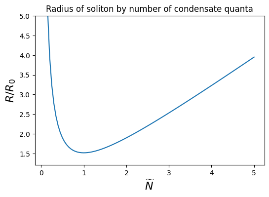
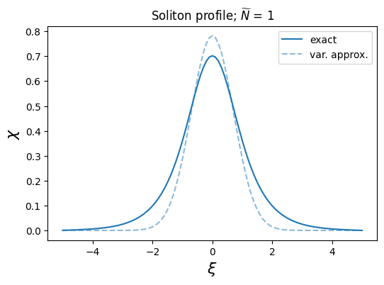
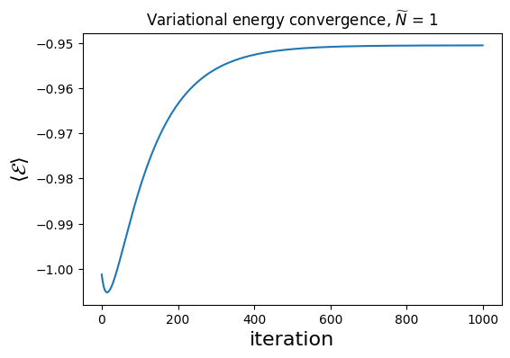
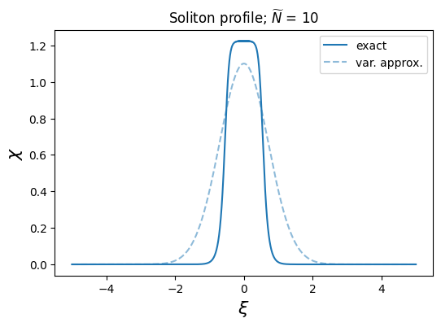

# Nonlinear Schrödinger soliton - stationary, 1 dimension
This is probably the simplest soliton you can possibly have.
The potential is a combination of a low-density attractive term, and a high-density repulsive term
$$ V(\psi) = \alpha (|\psi|^2 - \bar{\psi}^2)^2 = -\alpha \bar{\psi}^2 |\psi|^2 + \alpha |\psi|^4 $$
which results in a stable solution with a core density of $|\psi| \sim \bar{\psi}$.
The time-independent equation of motion is
$$
-\frac{1}{2m} \frac{d^2\psi}{dx^2} + \alpha(|\psi|^2 - \bar{\psi}^2)^2\psi = E \psi
$$
## [Approximate analytic solution](theory_computations.ipynb)
We can use the variational method with a Gaussian ansatz $\psi(x) = \psi_0 e^{-(x/R)^2}$ in order to derive an approximate solution.
Assuming the wave function is normalized to $\langle\psi|\psi\rangle = N$ (where $N$ is the number of quanta in the condensate), we can rewrite $\psi_0$ as
$$ \psi_0 = \left(\sqrt{\frac{2}{\pi}}\frac{N}{R}\right)^{1/2} $$
Evaluating the variational energy $\widetilde{E} = \langle \psi | \hat{H} | \psi \rangle$ (and substituting the above value of $\psi_0$), we can minimize with respect to $R$:
$$
\frac{d\widetilde{E}}{dR} = 0 \implies R = \frac{4\sqrt{3} N^2 \alpha m + 3\pi}{6\sqrt{\pi} N \alpha \bar{\psi}^2 m}
= \frac{R_0}{3^{1/4}} \frac{\widetilde{N}^2 + 1}{\widetilde{N}} \\ \, \\ \text{where} \quad
R_0 = (\sqrt{\alpha m} \bar{\psi}^2)^{-1}, \quad
N = \frac{3^{1/4}\sqrt{\pi}}{2\sqrt{\alpha m}} \widetilde{N}.
$$
We can see that for $\widetilde{N} \ll 1$ the radius actually decreases with increasing quanta like $O(1/N)$, but for $\widetilde{N} \gg 1$ the radius increses linearly.
It is likely that in the low-number regime, the soliton hasn't reached sufficient density to bind effectively.

## [Numerical solution](numerical_computations.ipynb)
Before attempting numerical calculation of $\psi(x)$, it will be convenient to make a couple transformations to simplify computations.
First of all, from our approximate analysis in the previous section, we expect the width of the soliton to be approximately $O(R)$.
Therefore, it would be prudent to transform our coordinate system like $x \rightarrow R \xi$, so that our new spatial coordinate $\xi$ is now a dimensionless quantity representing lengths in units of $R$.
This means that $\xi \sim O(1)$, simplifying our choice of grid points for numerical simulation.
Second, it will simplify the differential equation itself to transform $\psi \rightarrow \bar{\psi} \chi$.
Third, we can see that the the potential is nonzero when $\psi = 0$, which means that there is an infinite vacuum energy.
We can simply subtract off this constant term to get a finite value for the energy.
This does not alter the physics at all (unless considering general relativity), but makes things more numerically stable and easier to understand.
After these transformations, the differential equation looks like

$$
-\frac{1}{2} \frac{d^2\chi}{d\xi^2} + \beta^2\left[\left(|\chi|^2 - 1\right)^2 - 1 \right]\chi = \mathcal{E} \chi \\ \text{where} \quad
\beta = \sqrt{\alpha m} \bar{\psi}^2 R
= R/R_0
= \frac{\widetilde{N}^2 + 1}{3^{1/4}\widetilde{N}}, \quad
\mathcal{E} = m R^2 E
$$
which only has a single dimensionless free parameter $\widetilde{N}$, and a dimensionless energy eigenvalue $\mathcal{E}$.
Keep in mind that the wave function normalization condition is now
$$
\langle \chi | \chi \rangle = \int d\xi\, |\chi|^2
= \int \frac{dx}{R}\, \left|\psi/\bar{\psi}\right|^2
= \frac{N}{R \bar{\psi}^2}
= \frac{3^{1/4} \sqrt{\pi}}{2\beta} \widetilde{N}
= \frac{\sqrt{3\pi}}{2} \frac{\widetilde{N}^2}{\widetilde{N}^2 + 1}
$$
$\widetilde{N}$ is now the only free parameter in the entire scenario, which means that $\mathcal{E}$ is a function of $\widetilde{N}$ alone.
We can exploit this solve for the energy spectrum quite easily.

Normally, 1-dimensional Schrodinger equations are solved using a shooting technique that involves integrating the differential equation while performing a bisection search on the energy eigenvalue, with the termination condition being that the boundary conditions are (approximately) satisfied.
However, we can make use of the variational wave function derived above as a starting point.
In terms of $\chi$ and $\xi$, this is now

$$
\chi_0(\xi) = \left[\sqrt{\frac{3}{2}} \frac{\widetilde{N}^2}{\widetilde{N}^2 + 1}\right]^{1/2} e^{-\xi^2}
$$

Following along with with [Ref. 1](https://arxiv.org/abs/1701.08934), we can perform iterative updates to a discretized version of $\chi_0$ in order to relax the solution to the ground state or other low-lying excited states.
Below are some results:

We can see that the exact numerical solution is a bit broader than expected by the variational approximation, but that they are roughly the same size and density.
We can tell that the algorithm has converged by looking at the evolution of the variational energy over multiple iterations.

If we crank up the density and self-interaction strength of the soliton, we can see that it develops a nearly uniform density core, and is not as broad/diffuse as before.
This is what is known as a "thin-walled" soliton.

Recall that $\chi = 1$ is the minimum of the potential, so if it gets much higher than that (as the soliton becomes more dense), then an internal pressure is produced which keeps the soliton from collapsing further.